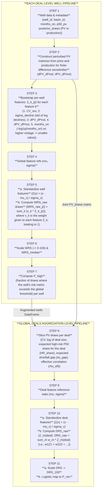

# Deal Risk Score Workflow Flowchart

- Well-level pipeline produces enriched `wells` data (WRS medians, `P_high`) and shared `pv_draws` for each deal.
- Deal-level pipeline ingests well outputs to compute deal summaries, standardized scores, and recommended underwriting percentiles.
